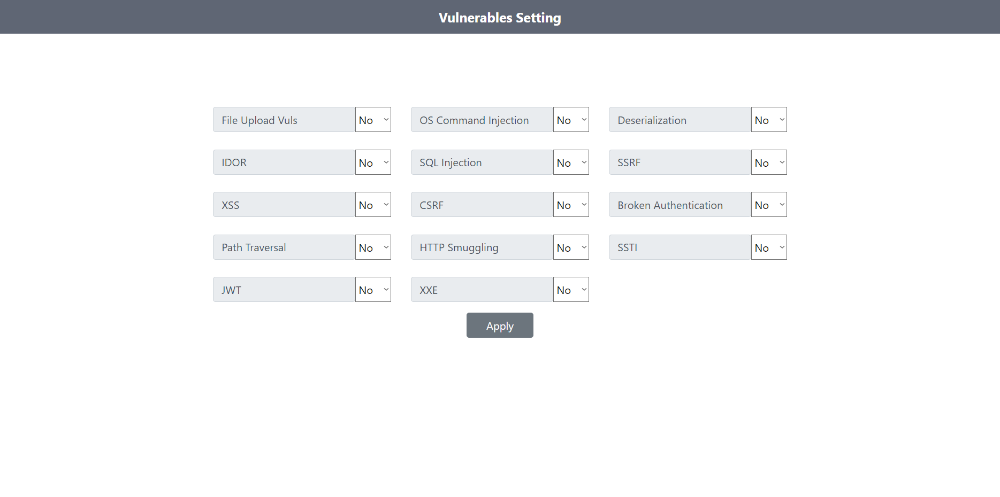

## Installation

### Step 1
```
git clone git@github.com:pentest-khoa-02/Group1.git
```

### Step 2
Running
```
docker-compose up --build
```

### Step 3
Go to: [localhost:3000/fakedata](http:localhost:3000/fakedata)

### Step 4
Go to: [localhost:3000/settings](http:localhost:3000/settings)



<!-- Enable babel: "dev": "nodemon --exec ./node_modules/.bin/babel-node ./src/app.js" -->