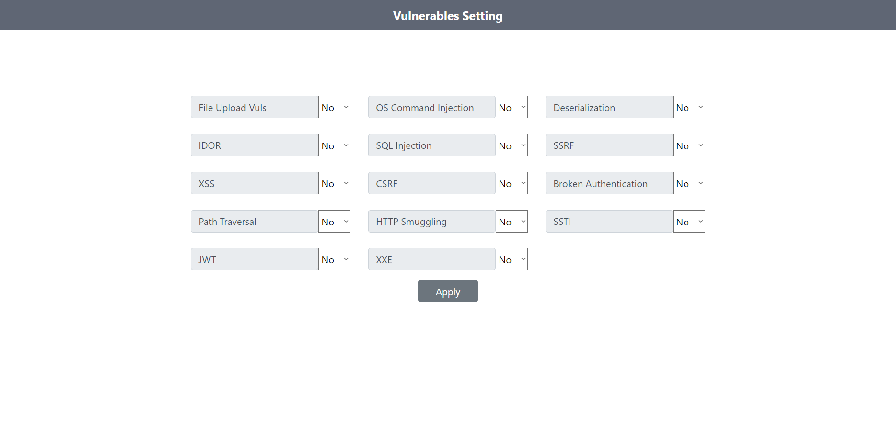

## Installation

### Step 1
```
git clone https://github.com/themingw666/web-social-vuls.git
```

### Step 2
Running
```
docker-compose up --build
```

### Step 3
Go to: [localhost:3000/fakedata](http:localhost:3000/fakedata)

### Step 4
Go to: [localhost:3000/settings](http:localhost:3000/settings)



## Review website and vulnerabilities


### SQL Injection
- Easy: Search function - http://localhost:3000/search?name=minh
- Medium: Timeline page - http://localhost:3000/timeline?id=666666
- Hard: Login function - http://localhost:3000/form-login

### JWT
- Easy, Medium, Hard: Authentication function

### SSRF
- Easy, Medium: Export profile function - http://localhost:3000/timeline?id=666666
- Hard: Post status function

### XSS
- Easy: Chat function - http://localhost:3000/messages
- Medium, Hard: Comment status function

### Broken Authentication
- Easy, Medium: Setting function - http://localhost:3000/setting?id=666666
- Hard:..